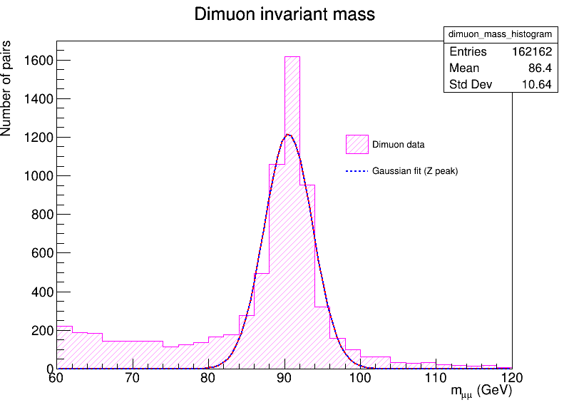

# ROOT_Particle_Peak_Analyzer

## Purpose
This project demonstrates how to analyze real CERN Open Data using ROOT and PyROOT
to identify particle resonance peaks in invariant mass distributions.

## Dataset
- **NanoAOD_DoubleMuon.root**
- Source: CERN Open Data
- Content: Proton–proton collision events with reconstructed muons

## Tools Used
- Python
- ROOT / PyROOT
- CERN Open Data

## Analysis Overview
- Muon pairs are selected from each collision event.
- The invariant mass of each muon pair is computed using four-vectors.
- A histogram of the dimuon invariant mass is created.
- A Gaussian fit is applied to the Z boson peak region.

## Results
A clear peak is observed around **91 GeV**, consistent with the Z boson decaying into two muons
(Z → μ⁺ μ⁻).

## Example Output

